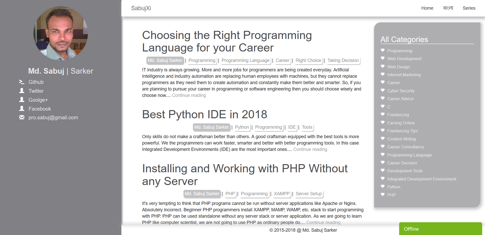

# Persona - Theme for personal websites for the professionals, bloggers, writers, serious online book authors
Persona is a theme for creating personal websites for publishing blog, online book and other cool stuffs.

This theme is created for Synamic. But you can edit and use it for any other purposes and use it with any other system, framework, whatever.

HTML, CSS, SASS, JavaScript was used to code this theme. The HTML is both in raw form and in Jinja template form.

The website of the author is here: [The Theme Developer](https://www.sabuj.me)

# A Sample Screenshot of the Theme

